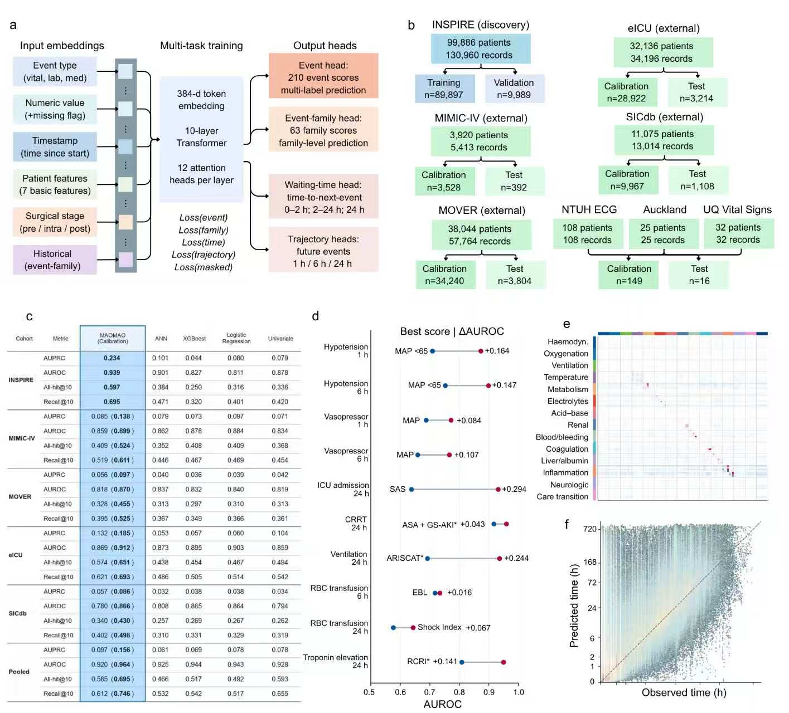

# MAOMAO
**Multi-horizon Anticipatory Outcome Model for Anesthesia and Operations**

[Demo / 演示](https://huggingface.co/spaces/luan0519/MAOMAO) · [Code / 代码](https://github.com/XIAOJIE0519/MAOMAO)



## Input → Output / 输入 → 输出
| Input / 输入 | Format / 格式 |
|---|---|
| Patient features / 基础信息 | `static`: age_at_operation(years), male(0/1), asa(0–6), emergency(0/1), weight_kg, height_cm; missing = 0 |
| Observed events / 已观察事件 | `events`: `time_min` (minutes since record start), `token` ([vocabulary](vocabulary.json)), optional `value` in original measurement units |

See [example.json](example.json): synthetic data / 合成示例。Submit observed history only. No patient identifiers / 仅输入已观察历史，不含身份信息。

| Output / 输出 | Meaning / 含义 |
|---|---|
| raw / calibrated | Relative next-event probabilities, normalized over 210 events / 210 类下一事件相对概率 |
| wait_hours | Event-specific expected waiting hours / 事件等待时间（小时） |
| risk_1h_raw / risk_6h_raw / risk_24h_raw | Uncalibrated horizon-head scores / 未校准时域预测 |
| event_logits | 210 raw scores in vocabulary order / 词表顺序的原始分数 |

## Run / 运行
```bash
pip install -r requirements.txt
python inference.py example.json --calibration None
python app.py
```
Weights download automatically from this model repository. To use local assets: `python inference.py example.json --model-dir .`.
权重自动下载；本地使用加 `--model-dir .`。

## Calibration / 校准
`p = softmax((logits + bias) / temperature)`

Select a dataset preset, or select **Custom** and paste a JSON with `temperature` and optional 210-element `bias`. Presets are only for their source distributions. `None` retains raw outputs.
选择来源预设，或 **Custom** 输入温度与可选的 210 项偏置；预设不等同于新医院验证。`None` 保留原始输出。

For a new source, split patients 90% calibration / 10% test. Inside calibration, use 80% to fit and 20% to select; refit on all calibration patients. Keep model weights frozen. Do not use test labels.
新来源按患者划分 90% 校准 / 10% 测试；校准部分内部 80/20 拟合与选择，再全量重拟合。冻结模型，不使用测试标签。

```bash
python calibrate.py --logits logits.npy --labels labels.npy --groups patient_groups.npy --output custom_calibration.json
```
`logits.npy`, `labels.npy`: `[N,210]`, labels are binary multi-hot; `patient_groups.npy`: `[N]` integer group IDs. Supply calibration rows only. Timing and horizon outputs are not changed by event calibration.
只提供校准行；标签为 multi-hot，分组为整数。事件校准不改变等待时间与时域输出。

## Model / 模型
384 dimensions · 10 Transformer layers · 12 attention heads · 210 events · 63 families · 1/6/24h heads. Development: INSPIRE, 99,886 patients / 130,960 surgical records. Internal micro-AUROC: 0.939; Recall@10: 0.695. External evaluation: frozen weights plus source-specific calibration, reported separately.

The last 256 tokens are encoded with prior-family history and monitoring features. Concurrent-event masking follows the training model. Inputs are event tokens, not unprocessed waveform data.
编码最近 256 个 token，并保留之前的家族历史与观测特征。沿用训练时并发事件屏蔽规则。输入为事件 token，不是原始波形。

Research use. Recorded events include care decisions; outputs do not establish treatment effects. Waiting-time error and external domain shift remain limitations. The supplied overview image contains the study's summary views; endpoint-specific reporting is not a prospective clinical validation.
研究用途。记录含临床决策，输出不代表治疗因果效应；等待时间误差和外部域差异仍有限制。

Weights are distributed as SafeTensors; no patient records, optimizer states or identifiers are included. See [release_manifest.json](release_manifest.json).
权重仅含模型张量，不含患者记录、优化器或身份信息。
